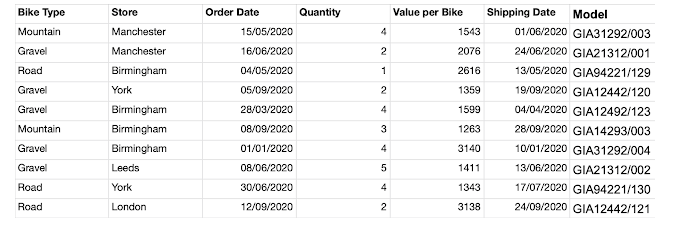
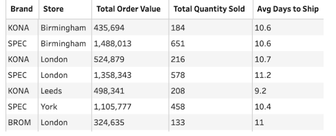

# The Challenge

This week we are looking at the different Brands of bikes available in our stores. We need to understand what are the most popular sellers and do the customers of the different brands have the same experience to other customers. 

We are creating simple summaries this week to get a quick, tabular view of the answers. If you want to visualise the data to highlight those trends even more clearly, go for it! 

- Clean up the Model field to leave only the letters to represent the Brand of the bike
- Workout the Order Value using Value per Bike and Quantity
- Aggregate Value per Bike, Order Value and Quantity by Brand and Bike Type to form: 
    Quantity Sold
    Order Value
    Average Value Sold per Brand, Type
- Calculate Days to ship by measuring the difference between when an order was placed and when it was shipped as 'Days to Ship'
- Aggregate Order Value, Quantity and Days to Ship by Brand and Store to form:
    Total Quantity Sold
    Total Order Value
    Average Days to Ship
- Round any averaged values to one decimal place to make the values easier to read

## Input - Bike Sales

### Expected Output 1 (5 fields, 15 rows):

### Expected Output 2 (5 fields, 25 rows):

