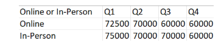

# The Challenge

For the third week of beginner month, we're going to be building on the skills that we've already learnt, as well as exploring new concepts. This week may feel a little more challenging, but I promise you're ready for it!

Data Source Bank has some quarterly targets for the value of transactions that are being performed in-person and online. It's our job to compare the transactions to these target figures.

## Input 1 - List of Transactions

## Input 2 - Quarterly Targets

### Expected Output Preview (5 fields, 8 rows)

