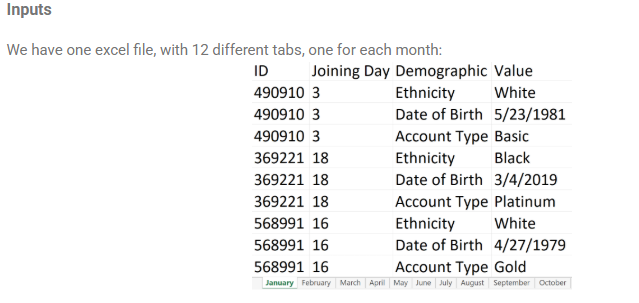
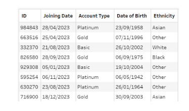

# The Challenge

It's the final week of beginner month already! Hopefully you've picked up a lot of new skills and have enjoyed the challenges. We'll add another new technique and build on your existing skills with this challenge.

Data Source Bank acquires new customers every month. They are stored in separate tabs of an Excel workbook so it's "easy" to see which customers joined in which month. However, it's not so easy to do any comparisons between months. Therefore, we'd like to consolidate all the months into one dataset. 

There's an extra twist as well. The customer demographics are stored as rows rather than columns, which doesn't make for very easy reading. So we'd also like to restructure the data.

## Input 1 - List of Transactions

### Expected Output Preview (5 fields, 989 rows)

