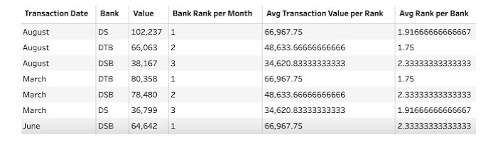

# The Challenge

The intermediate month begins by building on the aggregation technique covered in week 1. This week's challenge looks at two analytical calculations that can make the use of the data source much easier for end users. 

## Input 1 - Same as 2023 Week 1

### Expected Output Preview (6 fields, 36 rows)

