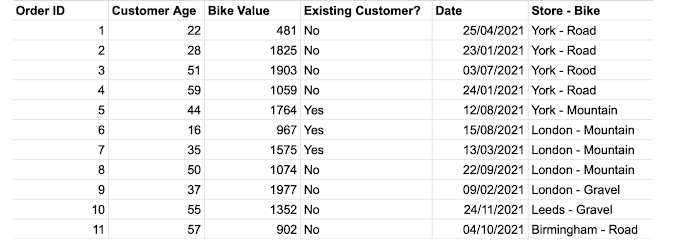
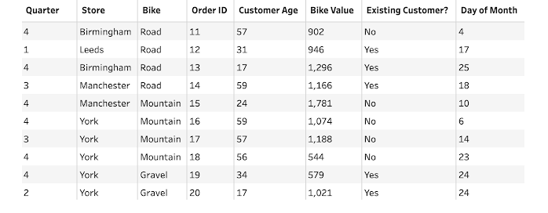

# The Challenge

Bike Store Sales - This week we are going to be focusing on cleaning data ready to answer some questions from our stakeholders. In the requirements I will be adding some links to some useful resources if you get stuck on a particular requirement. 

- Split the 'Store-Bike' field into 'Store' and 'Bike'
- Clean up the 'Bike' field to leave just three values in the 'Bike' field (Mountain, Gravel, Road)
- Create two different cuts of the date field: 'quarter' and 'day of month'
- Remove the first 10 orders as they are test values

## Input

### Expected Output Preview (8 fields, 990 rows):

