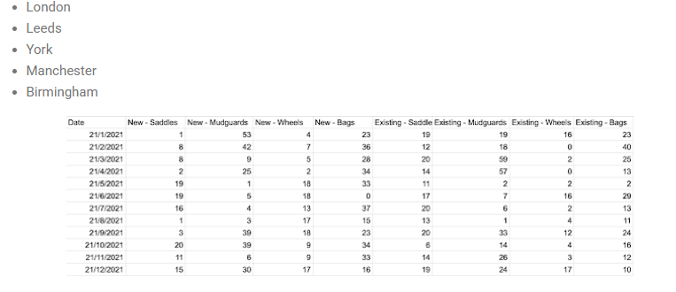
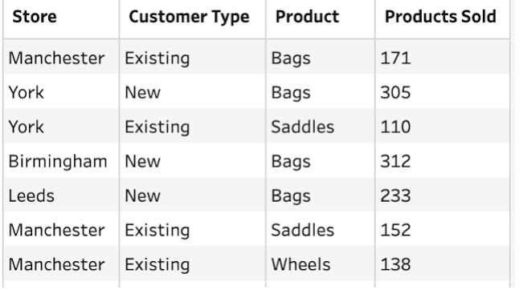

# The Challenge

This week is the third in the Starter Challenges series we are running to kick off 2021.  

This challenge will introduce you to the two main types of reshaping data, pivoting and aggregation. We used aggregation last week so we are building on this technique this week. We will also let you work with Unions where we stack data sets that have similar structures on top of each other. 

As with all of our January 2021 challenges, we will be sharing useful links to helpful videos and articles that will give you more technical support if you need it. 

This week's challenge sees us looking at the Accessory Sales at our Bike Store.

    - Input the data source by pulling together all the tables
    - Pivot 'New' columns and 'Existing' columns
    - Split the former column headers to form:
    - Customer Type
    - Product
    - Rename the measure created by the Pivot as 'Products Sold'
    - Create a Store column from the
    - Remove any unnecessary data fields
    - Turn Date into Quarter
    - Aggregate to form two separate outputs of the number of products sold by:
    - Product, Quarter
    - Store, Customer Type, Product

## Input - 5 Accessory Sales Tables, one for each store with the following structure

### Expected Output (4 fields, 16 rows)

