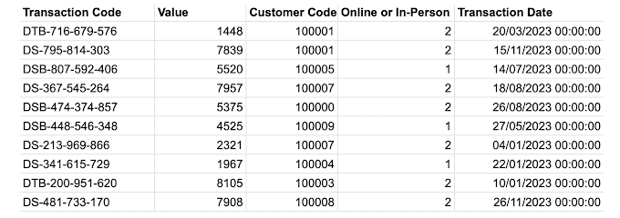
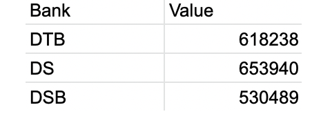
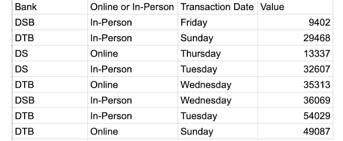
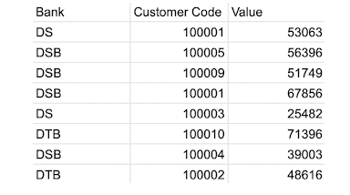

# The Challenge

Welcome to a New Year of Preppin' Data. These are weekly exercises to help you learn and develop data preparation skills. We publish the challenges on a Wednesday and share a solution the following Tuesday. You can take the challenges whenever you want and we love to see your solutions. With data preparation, there is never just one way to complete the tasks so sharing your solutions will help others learn too. Share on Twitter, LinkedIn, the Tableau Forums or wherever you want to too. Tag Jenny Martin, Tom Prowse or myself or just use the #PreppinData to share your solutions. 

The challenges are designed for learning Tableau Prep but we have a broad community who complete the challenges in R, Python, SQL, DBT, EasyMorph and many other tools. We love seeing people learn new tools so feel free to use whatever tools you want to complete the challenges. 

A New Year means we start afresh so January's challenges will be focused on beginners. We will use different techniques each week to help you develop your skills. In February, we will set the challenges at an intermediate level and then in March we will do some advanced challenges. January's challenges will have links to useful videos and blogposts to help you learn a technique if it is new to you. 

The subject for January will be our new (fake) bank -- The Data Source Bank (DSB). This week we have had a report with a number of transactions that have not just our transactions but other banks' too. Can you help clean up the data?

## Input

### Expected Output 1 Preview (2 fields, 3 rows):

### Expected Output 2 Preview (4 fields, 42 rows):

### Expected Output 3 Preview (3 fields, 33 rows):

